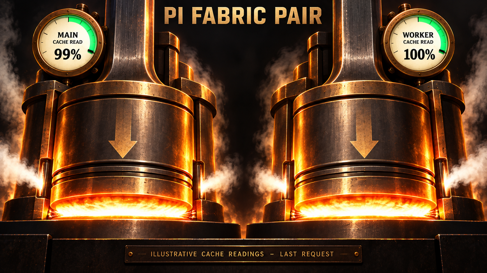

# pi-fabric-pair

**Your Main plans and reviews. A persistent worker builds.**



*Artwork shows illustrative cache readings.*

Pi Fabric Pair gives your [Pi](https://github.com/earendil-works/pi) session a
dedicated coding worker. Keep talking with Main while the worker implements a
bounded task. Main receives the result, inspects the code, and approves or asks
for changes. The worker keeps its conversation across revisions and tasks.

Both roles use your existing [Fabric](https://github.com/monotykamary/pi-fabric)
and [Fovea](https://github.com/monotykamary/pi-fovea) setup. Choose their models
separately.

```text
Main -- task ----------------------> Worker
Main <-- report + code evidence ---- Worker
Main -- answer / revise / approve -> same Worker
```

**Experimental MVP:** one Main, one writer, one unresolved assignment. Start in a
disposable Git workspace with manual startup and every-step review.

## Get started

You need **Node.js 24+**, Git, and Pi with Fabric, Fovea, and an authenticated model.

### 1. Install

```sh
git clone https://github.com/asx8678/pi-fabric-pair.git
cd pi-fabric-pair
pi install "$PWD"
```

The extension runs directly from source. Open Pi in your implementation project's
Git working tree. Keep Pair state outside that tree; the default
`~/.pi/agent` location does this.

### 2. Prepare Fabric

Merge these fields into the worker's effective `fabric.json`:

```json
{
  "prewalk": { "enabled": false },
  "executor": { "shellHangMs": 0 },
  "agents": { "maxDepth": 0 }
}
```

Global defaults normally live in `~/.pi/agent/fabric.json`; trusted worker-project
settings can override them. These fields disable Prewalk, automatic background
shell spill, and recursive agents. They affect Main too if it shares the profile.
Keep native automatic compaction enabled. Pair checks this setup without editing
it. See the [quickstart](docs/QUICKSTART.md) for paths and troubleshooting.

### 3. Start the worker

Open `/pair settings`:

| Setting | First-run value |
| --- | --- |
| Enabled for new work | On |
| Autostart | Off |
| Worker model and effort | An authenticated model and supported effort |
| Review policy | `every-step`, with final review required |

Settings save after each valid edit. Close with **Done** or Esc, then run:

```text
/pair start worker
/pair doctor
```

Startup checks readiness without requesting a model turn. Main's model stays
under `/model`.

Now ask Main:

> Use Pair's worker to make one small change. Inspect its diff and verification
> results, and ask me before approving it.

Reports arrive automatically. Review gates govern Main's decisions; asking the
human before each approval requires that explicit instruction.

## Everyday controls

| Command | Purpose |
| --- | --- |
| `/pair` | Open the dashboard. |
| `/pair settings` | Choose the worker, review policy, and limits. |
| `/pair status` | See activity, progress, and observed cache usage. |
| `/pair inbox` | Inspect retained reports. |
| `/pair cancel worker` | Cancel the task and keep the conversation. |
| `/pair stop worker` | Stop the worker process and retain its history. |

Cancel and stop do not undo file changes. Normal Main shutdown also stops owned
workers. The [reference](docs/REFERENCE.md) covers pause, resume, staged settings,
and the remaining commands.

## Review you can inspect

Approval is tied to an inspected code checkpoint. Source changes after that
checkpoint invalidate approval.

Add project checks under **Settings > Advanced > Verification commands**.
Failed checks block approval when `requirePassing` is enabled. An empty command
list means no independent checks ran.

## Context, warming and cost

Main and Worker retain separate conversations. **Cache read (last)** shows the
share of measured input read from provider cache on each role's last request.
The artwork's 99-100% values are examples; actual results vary.

Optional cache warming is **off by default**. It requires compatible native SDK
support, can incur paid usage, and does not guarantee cache hits. Pair's inference
budgets exclude Main usage and native warming. See the
[cache reference](docs/REFERENCE.md#context-warming-and-cost).

## More details

Pair provides workflow controls; OS and tool permissions remain your security
boundary. Unattended operation, automatic crash recovery, and multiple writers
are outside this MVP.

[Quickstart](docs/QUICKSTART.md) |
[Reference](docs/REFERENCE.md) |
[Example config](fabric-pair.example.json) |
[Compatibility](docs/COMPATIBILITY.md) |
[Security](docs/SECURITY.md) |
[Testing](docs/TESTING.md) |
[Changelog](CHANGELOG.md)

[MIT license](LICENSE).
