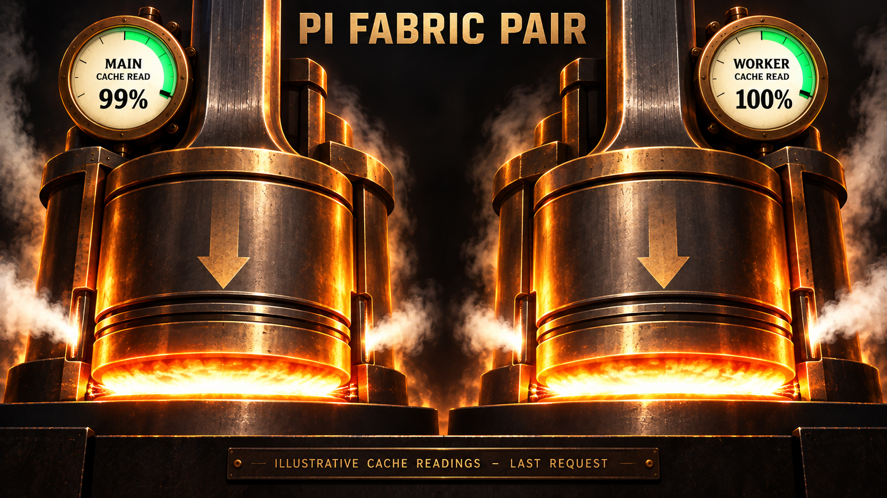
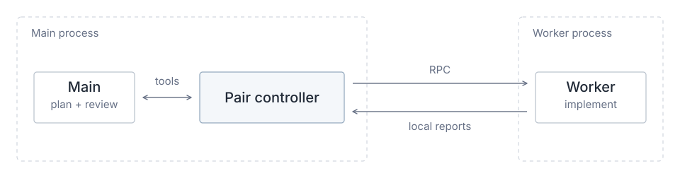
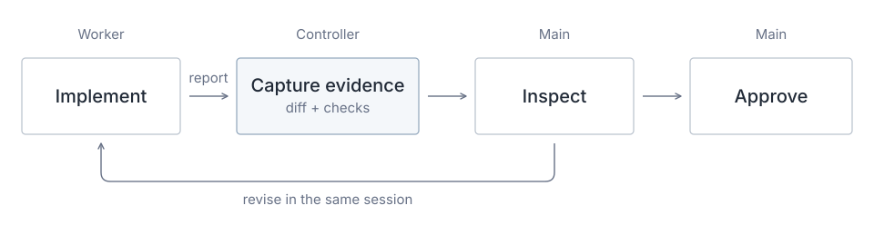
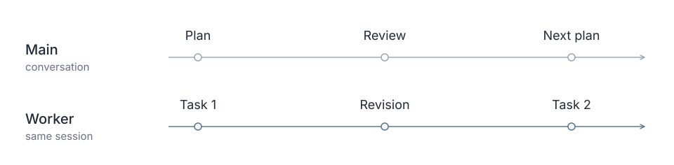

# pi-fabric-pair

**Your Main plans and reviews. A persistent worker builds.**



*Artwork shows illustrative cache readings.*

Pi Fabric Pair gives your [Pi](https://github.com/earendil-works/pi) session a
dedicated coding worker. Keep talking with Main while the worker implements a
bounded task. Main receives the result, inspects the code, and approves or asks
for changes. The worker keeps its conversation across revisions and tasks.

Both roles use your existing [Fabric](https://github.com/monotykamary/pi-fabric)
and [Fovea](https://github.com/monotykamary/pi-fovea) setup. Choose their models
separately.

```text
Main -- task ----------------------> Worker
Main <-- report + code evidence ---- Worker
Main -- answer / revise / approve -> same Worker
```

**Experimental MVP:** one Main, one writer, one unresolved assignment. Start in a
disposable Git workspace with manual startup and every-step review.

## How Pair works



Pair's controller runs inside Main's Pi process and manages one persistent worker
through Pi's JSONL RPC. The worker edits the Git workspace and saves reports
locally before Main is notified. See the
[architecture and invariants](docs/ARCHITECTURE.md).

## Get started

You need **Node.js 24+**, Git, and Pi with Fabric, Fovea, and an authenticated model.

### 1. Install

```sh
git clone https://github.com/asx8678/pi-fabric-pair.git
cd pi-fabric-pair
pi install "$PWD"
```

The extension runs directly from source. Open Pi in your implementation project's
Git working tree. Keep Pair state outside that tree; the default
`~/.pi/agent` location does this.

### 2. Prepare Fabric

Merge these fields into the worker's effective `fabric.json`:

```json
{
  "executor": { "shellHangMs": 0 },
  "agents": { "maxDepth": 0 }
}
```

Global defaults normally live in `~/.pi/agent/fabric.json`; trusted worker-project
settings can override them. These fields disable automatic background shell spill
and recursive agents. They affect Main too if it shares the profile; Fabric has no
per-process setting yet. Prewalk may stay enabled, but `prewalk.alwaysRearm` must
not be `true`: an auto-armed worker would hand its first edit to another model.
Keep native automatic compaction enabled. Pair checks this setup without editing
it. See the [quickstart](docs/QUICKSTART.md) for paths and troubleshooting.

If you tighten Fabric's approval policies, classify Pair's tools too; see
[approval risk for Pair tools](docs/REFERENCE.md#approval-risk-for-pair-tools).

### 3. Start the worker

Open `/pair settings`:

| Setting | First-run value |
| --- | --- |
| Enabled for new work | On |
| Autostart | Off |
| Worker model and effort | An authenticated model and supported effort |
| Review policy | `every-step`, with final review required |

Settings save after each valid edit. Close with **Done** or Esc, then run:

```text
/pair start worker
/pair doctor
```

Startup checks readiness without requesting a model turn. Main's model stays
under `/model`.

Now ask Main:

> Use Pair's worker to make one small change. Inspect its diff and verification
> results, and ask me before approving it.

By default (`autoDeliverReports: true`) a finished report is delivered to Main
automatically once Main's current work is done, and never interrupts it; see
[Report delivery](docs/REFERENCE.md#report-delivery-phases-and-branches). Review gates govern
Main's decisions; asking the human before each approval requires that explicit
instruction.

## Everyday controls

| Command | Purpose |
| --- | --- |
| `/pair` | Open the dashboard; it lists what needs you first. |
| `/pair settings` | Choose the worker, review policy, and limits. |
| `/pair status` | See activity, progress, and observed cache usage. |
| `/pair reload` | Reload saved Pair settings while Main stays open. |
| `/pair restart worker` | Reload settings and restart only the worker, keeping its conversation. |
| `/pair report` | Read the current report as a card (read-only; Main still inspects). |
| `/pair diff` | Scroll the checkpoint diff; `[`/`]` jump between files, `/` searches. |
| `/pair inbox` | Inspect retained reports. |
| `/pair yield` | Explicitly send retained, unacknowledged reports to Main. |
| `/pair reconcile` | After a Main crash, prove the old worker process exited so the worker can be used again. |
| `/pair cancel worker` | Cancel the task and keep the conversation. |
| `/pair stop worker` | Stop the worker process and retain its history. |

Restart keeps Main's model and session open. Interrupted work waits for explicit
resume; staged model changes require finishing or cancelling the current task.
Invalid configuration leaves the last valid settings in use.

Cancel and stop do not undo file changes. Normal Main shutdown also stops owned
workers; `/new`, `/resume` or a fork asks first while the worker is running. The [reference](docs/REFERENCE.md) covers pause, resume, staged settings,
and the remaining commands.

## Review you can inspect

Approval is tied to an inspected code checkpoint. Source changes after that
checkpoint invalidate approval.



After reporting, the worker waits. The controller lets execution settle, runs
configured checks, and captures the source evidence. Reports wait in Pair's
durable inbox and, by default, are delivered to Main automatically once Main's
current work is done: at the end of its current run, or as a new turn if Main is
idle. A report never interrupts Main, never rides on your prompt, and never takes
your prompt's place; if the two collide, your message is sent first. With
`autoDeliverReports: false` they never wake Main. Main can always call `pair_yield` to
receive every unacknowledged report (repeat reads return the same reports until
inspected or decided); a yield that found nothing arms one settlement-boundary
delivery for a late result, and anything later stays retained until the next
explicit review. Humans can always use `/pair yield` or `/pair inbox`. After a
branch navigation, Main re-inspects a pending report before deciding. Main
inspects the checkpoint and approves, revises, or cancels. Revisions continue in the same worker session;
final approval completes the task and retains that session.

Add project checks under **Settings > Advanced > Verification commands**.
Failed checks block approval when `requirePassing` is enabled. An empty command
list means no independent checks ran.

## Context, warming and cost



Main and Worker keep separate conversations. Include relevant constraints in
each work order; the worker does not inherit Main's private chat. Native Pi/Fabric
manages compaction, while Pair retains task state separately.

The status line's **cache** reading (for example `cache M 99% W 100%`) shows the
share of measured input read from provider cache on each role's last request. The hero artwork's 99-100% values are examples;
actual results vary.

Both roles can use Pi's native cache warmer. With `"cacheWarming": "idle"` in
Pi's global settings, Pair keeps Main's cache warm while the worker works and the
worker's cache warm while its report waits for Main, using Pi's own savings rule.
This works for every model: Pi warms only models it knows a cache lifetime for
(built in: Anthropic only), so Pair gives any other model a 4-minute lifetime
before it runs, and never changes one Pi already knows. Pi stops 30 minutes after a
session's last request. Pair never warms a Codex model, because Pi cannot cap that
refresh; `/pair doctor` says when Main or the worker uses one. Fabric's `cache.hold` (Fabric 0.97.0 or newer, on a Pi with scoped
warming) is a separate paid opt-in for Main. Pair holds no leases and never changes
Pi's settings. Pair's inference budgets exclude Main usage and warming. Stock Pi
0.87.1 does not yet send these refreshes in a Pair session (its warmer stops once
Pair's messages are in context); see the
[cache reference](docs/REFERENCE.md#context-warming-and-cost).

## More details

Pair provides workflow controls; OS and tool permissions remain your security
boundary. Unattended operation, automatic crash recovery, and multiple writers
are outside this MVP. Verify changes with the offline suite (`npm test`, no
model requests or profile writes; see `tests/README.md`) and the static checks
(`npm run typecheck`, `npm run pack:check`).

[Quickstart](docs/QUICKSTART.md) |
[Architecture](docs/ARCHITECTURE.md) |
[Reference](docs/REFERENCE.md) |
[Example config](fabric-pair.example.json) |
[Compatibility](docs/COMPATIBILITY.md) |
[Security](docs/SECURITY.md) |
[Changelog](CHANGELOG.md)

[MIT license](LICENSE).
